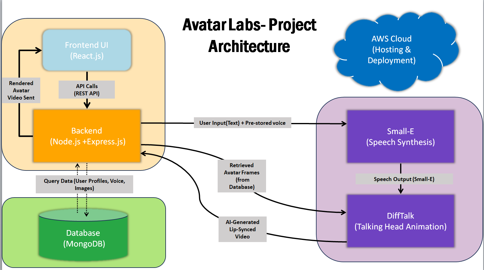

# AvatarLab

### Project Purpose
Our project is about **developing an AI Avatar** that can produce **realistic talking head animations**. Through the use of **diffusion models**, we generate expressive and temporally coherent facial expressions in sync with speech. This technology can be used to create lifelike digital avatars for many applications.

### Project Applications
- **Virtual Avatars** for gaming, metaverse, and social media.
- **AI-powered dubbing** for movies and videos.  
- **Assistive technology** for people with speech impairments.  
- **Enhanced video conferencing** with animated facial expressions.  

## ???? Architecture Diagram  
  
*(Replace `path-to-architecture-diagram.png` with the actual image path in your repository.)*  

## ???? Workflow Diagram  
  
*(Replace `path-to-workflow-diagram.png` with the actual image path in your repository.)*  

### Workflow Explanation
#### **Input:**
- **Audio:** A stream of audio frames containing speech.
- **Reference Face Image (Xr):** A single face image of the target for identity establishment.
- **Masked Ground-Truth Image (Xm):** The real video frame with the mouth area masked out to supply head pose information.

#### **Processing:**
- **Audio Encoding:** Extracts smooth audio features.
- **Image Encoding:** The ground-truth face image (Xr) and masked ground-truth image (Xm) are encoded into latent space.
- **Conditional Diffusion Process:** A Gaussian noise is progressively denoised by the denoising network (M), conditioned on encoded audio features.
- **Decoding:** The denoised latent representation is decoded back to pixel space to produce the final animated face.

## ???? Brief Explanation of the Reference Research Papers

### **1. Small-E: Small Language Model with Linear Attention for Efficient Speech Synthesis**
Conventional **text-to-speech (TTS) models** suffer from **high computational costs** and **alignment problems** (word skipping & repetition). **Small-E** overcomes these by:
- Employing **Linear Causal Language Model (LCLM) Blocks** in place of transformers, thus being **62% more efficient**.
- Presenting **Position-Aware Cross-Attention (PACA)** to address skipping and repetition problems.  
- Making use of **Conditional Codec Language Modeling (CCLM)** for enhanced speech token prediction.

✅ **Strengths:**  
- Cost-effective and **low-resource friendly** TTS model.  
- **Improved speech alignment** without retraining on new voices.

❌ **Weaknesses & Future Research:**  
- Restricted **comparisons with state-of-the-art (SOTA) models** based on availability.
- Requires optimization for **multilingual speech synthesis**.

---

### **2. DiffTalk: Designing Diffusion Models for Generalized Audio-Driven Portrait Animation**
Current **talking head animation models** face quality vs. generalization trade-offs. **DiffTalk** addresses this by:
- Applying a **Latent Diffusion Model (LDM)** to produce high-quality facial animations.
- Utilizing **multi-modal conditioning** (Audio, Reference Image, Facial Landmarks) for **natural lip-sync and expressions**.
- Operating in a **compressed latent space**, facilitating **efficient and high-resolution animation**.

✅ **Key Strengths:**
- **Improved generalization** to other identities without the need for retraining.
- **Improved quality over GAN-based models** without compromising on stability.

❌ **Limitations & Future Work:**
- Remain **computationally expensive** relative to more straightforward GAN-based approaches.
- May require **fine-tuning for extreme facial variations**.

--- 

### **Final Takeaways:**

| Feature         | **Small-E (TTS)** | **DiffTalk (Talking Head Animation)** |
|----------------|------------------|--------------------------------------|
| **Key Focus**  | Efficient text-to-speech (TTS) | High-quality talking head generation |
| **Core Tech**  | Linear Attention (LCLM) + PACA | Latent Diffusion Models (LDM) |
| **Efficiency** | 62% faster training | High-resolution with low compute |
| **Generalization** | Handles multiple speakers | Works across different identities |
| **Key Strength** | Performs well on budget hardware | Creates top-notch lip-sync animations |
| **Key Weakness** | few SOTA comparisons available | Requires fine-tuning for pathological cases |

Both papers present **scalable and efficient AI-based speech & animation tech**, so they are well-suited for **virtual avatars, dubbing, and real-time use**. ????

---