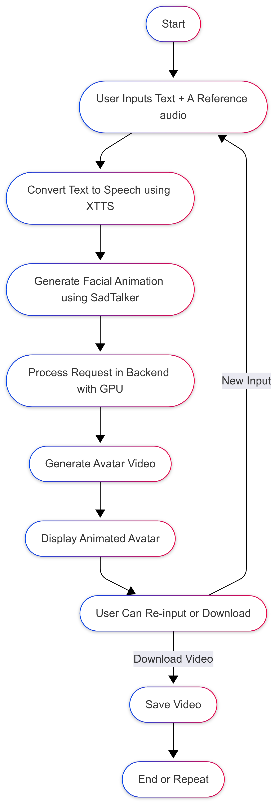

# AvatarLab

### Project Purpose
AvatarLab is an AI-based system designed to generate **realistic talking head videos** by combining cutting-edge **voice cloning** and **lip-sync facial animation** technologies. The system enables users to create lifelike AI avatars that speak with natural expressions synced to their voice or any input text.

### Project Applications
- **Virtual avatars** for games, social media, and the metaverse  
- **AI dubbing** for videos and films  
- **Assistive tech** for people with speech impairments  
- **Animated spokespersons** for education, marketing, or news  
- **Enhanced virtual meetings** with expressive digital characters  

---

## Architecture Diagram  
  

## Workflow Diagram  


---

### Workflow Explanation

#### **Inputs:**
- **Text Input:** User-provided text to be spoken.
- **Reference Audio (optional):** A sample of the speaker's voice to clone.
- **Avatar Image:** A single frontal face image of the target character.

#### **Processing:**
- **Voice Generation (XTTS by Coqui):**
  - Converts text into natural speech using Coqui's **XTTS** model.
  - Can clone voice using a short sample and supports multilingual speech synthesis.

- **Video Generation (SadTalker):**
  - Takes the generated speech and avatar image as input.
  - Produces a **realistic talking head video** with accurate lip-sync and facial expressions.

#### **Outputs:**
- **Final AI Avatar Video:** A short talking head clip with synchronized speech and expressions.

---

## Technology Stack

| Component           | Model Used              |
|--------------------|-------------------------|
| Text-to-Speech     | **XTTS v2 (Coqui TTS)** |
| Video Generation   | **SadTalker**           |
| Frontend           | React.js                |
| Backend API        | Node.js + Express       |
| AI Orchestration   | Python + Flask          |
| Database           | MongoDB (Atlas)         |

---

## Reference Models & Research

### 1. **XTTS v2 (Coqui TTS) – Voice Cloning**
- An advanced multilingual, zero-shot **text-to-speech** model.
- Supports **voice cloning** from short audio samples.
- Produces natural speech with high clarity and prosody control.
  
✅ **Strengths:**  
- Supports multiple languages and speakers.  
- No fine-tuning required for new voices.  
- Open-source and easy to deploy.

❌ **Limitations:**  
- Might need preprocessing for noisy audio.  
- Larger models require moderate compute resources.

---

### 2. **SadTalker – Talking Head Video Generation**
- A **lip-sync-driven video synthesis model** for generating expressive face animations.
- Works from a single reference image and audio file.
- Combines facial motion retargeting, landmark-based head control, and audio-guided expression mapping.

✅ **Strengths:**  
- Produces realistic facial movements with good lip-sync.  
- Requires only a single image and audio input.  
- Open-source and GPU-friendly.

❌ **Limitations:**  
- Performance may drop with extreme head poses.  
- Works best with frontal facial images and clean audio.

---

## Final Takeaways

| Feature              | **XTTS (Voice)**       | **SadTalker (Video)**        |
|---------------------|------------------------|------------------------------|
| **Key Function**     | Text-to-speech + cloning | Realistic lip-sync video      |
| **Input**            | Text + voice sample    | Face image + audio           |
| **Output**           | Natural speech (.wav)  | Talking head video (.mp4)    |
| **Open-source**      | ✅                     | ✅                            |
| **Ideal For**        | Multilingual, custom speakers | Fast video avatars        |

Together, **XTTS** and **SadTalker** offer a **powerful pipeline** to create expressive, personalized AI avatars suitable for media, communication, and entertainment applications.

---
## 🧠 AI Server Setup Instructions

Clone and set up the following AI model repositories and place the corresponding Python orchestration files in the correct locations as shown below.

### Step 1: Directory Structure
```
AVATAR/                         ← Root directory (create a folder named `AVATAR` and clone the repositories inside it)
├── sad/
│   ├── SadTalker/              ← Clone from: https://github.com/OpenTalker/SadTalker
│   └── talk.py                 ← Place your video generation logic here
├── XTTS/
│   └── TTS/                    ← Clone from: https://github.com/coqui-ai/TTS
│       └── main.py             ← Place your voice generation logic here
└── back.py                     ← Main Flask server to coordinate XTTS and SadTalker
```

## 🚀 How to Run the Application


▶️ **Steps:**

1. Make sure all dependencies are installed (Python, Node.js, required packages).
2. Navigate to the project root directory.

### 🪟 For Windows Users (One-click using Windows Terminal):

A ready-to-use batch script is provided to launch all services in separate terminals.
Run the script by either:
  - Double-clicking `run_all_services.bat`  
  - Right-click → "Run with PowerShell"  
  - Open a terminal and run:

```bash
  ./run_all_services.bat
```

### 🪟 For Linux/macOS Users :
Run the commands below in separate terminals (From the root directory of the project):

# 1. Start XTTS voice generation server
```bash
cd AVATAR/XTTS/TTS
uvicorn main:app --host 0.0.0.0 --port 8001
```

# 2. Start SadTalker video generation server
```bash
cd AVATAR/sad
uvicorn talk:app --host 0.0.0.0 --port 8002
```

# 3. Start the main Python backend
```bash
cd AVATAR/
uvicorn back:app --host 0.0.0.0 --port 8003
```

# 4. Start the React frontend
```bash
cd frontend
npm start
```
# 5. Start the Express backend
```bash
cd /backend/src
node server.js
```

## 📌 Contributors
| **Member Name** | **GitHub ID**                                           | **Milestone 1 PPT**                          | **Milestone 1 Video**                                     | **Milestone 2 PPT**                         | **Milestone 2 Video**                                |
| --------------- | ------------------------------------------------------- | -------------------------------------------- | --------------------------------------------------------- | ------------------------------------------- | ---------------------------------------------------- |
| V. Gayathri     | [Gayathri424](https://github.com/Gayathri424)           | [PPT](Milestone1/Milestone1_Gayathri.pptx)   | [Video](https://youtu.be/hy0EjIdpxPQ)                     | [PPT](Milestone2/Milestone2_Gayathri.pptx)  | [Video](https://www.youtube.com/watch?v=zWr62T9U9pY) |
| P. Praneetha    | [Praneetha826](https://github.com/Praneetha826)         | [PPT](Milestone1/Milestone-1_Praneetha.pptx) | [Video](https://youtu.be/Zpe5A5bYTZ4)                     | [PPT](Milestone2/Milestone2_Praneetha.pptx) | [Video](https://www.youtube.com/watch?v=f3SkKz5ZNnQ) |
| G. Sreeshma     | [Sreeshma767](https://github.com/Sreeshma767)           | [PPT](Milestone1/Milestone1_Sreeshma.pptx)   | [Video](https://www.youtube.com/watch?v=7i2dm2PzNuE)      | [PPT](Milestone2/Milestone2_Sreeshma.pptx)  | [Video](https://youtu.be/PBj2CQrsfbU)                |
| P. Anushkaa     | [ANUSHKAAPARSI](https://github.com/ANUSHKAAPARSI)       | [PPT](Milestone1/Milestone1_Anushkaa.pptx)   | [Video](https://youtu.be/y2zOjcmLXY0)                     | [PPT](Milestone2/Milestone2_Anushkaa.pptx)  | [Video](https://youtu.be/yn414R8w2jc)                |
| V. Risheel      | [Risheel-kumar](https://github.com/Risheel-kumar)       | [PPT](Milestone1/Milestone1_Risheel.pptx)    | [Video](https://youtu.be/dEYDJZ90aNQ)                     | [PPT](Milestone2/Milestone2_Risheel.pptx)   | [Video](https://youtu.be/mcQ1CsVy3OA)                |
| G. Srithi       | [srithi-05](https://github.com/srithi-05)               | [PPT](Milestone1/Milestone1_Srithi.pptx)     | [Video](https://youtu.be/HTguEdLbxPE?si=wS6KDrdPpw3tC972) | [PPT](Milestone2/Milestone2_Srithi.pptx)    | [Video](https://youtu.be/af9RIjETkg8)                |
| P. Lavanya      | [lavanya-panthulu](https://github.com/lavanya-panthulu) | [PPT](Milestone1/Milestone1_Lavanya.pptx)    | [Video](https://youtu.be/NMLaW-gHpkg)                     | [PPT](Milestone2/Milestone2_Lavanya.pptx)   | [Video](https://youtu.be/5Pae4VqpDEo)                |
